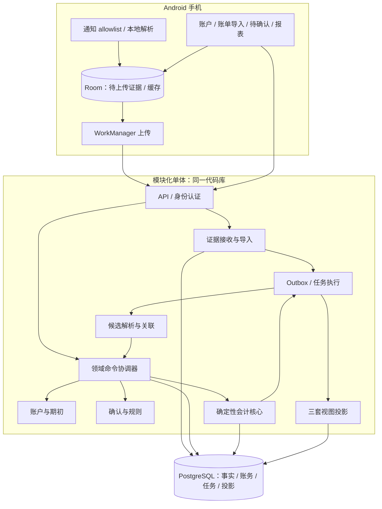

# 钱本 Technical Design v0.1

2026-10-06 · 架构设计稿 · 基于 PRD v0.3.2

本稿确定业务模块、数据权威、事务边界、异步协议和实现顺序；不是已经实现或测试通过的系统。后端语言暂建议 Go，用户偏好待确认。数据库约束 SQL、迁移脚本与可运行原型是后续交付，本文不宣称具备完整 DDL。

## 1. 架构决策

采用 Android 原生客户端＋模块化单体＋PostgreSQL。API 与 worker 使用同一代码库、同一领域逻辑，可以分别启动。服务端是正式账本的唯一写入权威；手机离线采集和缓存，不维护第二套可独立改写的正式账本。

MVP 不引入 Redis、Kafka、搜索集群或独立 AI 服务。数据库保存可靠任务及事务 outbox。AI、正式对账、折旧和估值按 PRD 后续版本引入。

| 决策 | 理由 | 代价/扩展条件 |
|---|---|---|
| 单体内跨模块数据库事务 | 事件接受与入账修复可以原子提交 | 模块禁止互相绕过服务写表 |
| 同一账本的领域写入串行化 | 简化候选竞争、merge/split、投影顺序 | 同一账本写吞吐受限；发现实际瓶颈再改细粒度锁 |
| 金额以整数分保存 | CNY 计算无浮点误差 | 原币和汇率另用定点十进制，明确舍入 |
| 证据/修订/账务追加，当前指针可更新 | 同时支持审计和高效当前查询 | 不把所有表都做成不可变事件流 |
| 异步报表按账本版本发布 | 避免修复只显示一半 | 报表允许延迟并显示数据版本 |

## 2. 组件图



图中箭头表达调用和数据流，不表示每一步都独立提交。命令协调器负责把需要一致生效的跨模块写入放进同一个事务。

## 3. 模块与数据权威

| 模块 | 拥有的数据 | 对外能力 |
|---|---|---|
| Identity | 用户、设备、会话、删除状态 | 鉴权、设备撤销、账本授权 |
| Evidence | SourceEvent、Observation、Delivery、解析结果版本、StatementImport/Line | 接收、去重、必要原文保留、可用证据查询 |
| Accounts | LedgerAccount、ExternalAccount、Instrument、Rail、FundingRelation、OpeningBalance | 账户映射、初始化、候选资金来源 |
| Events | Lineage、Revision、证据关联、身份关系、经济关系、实际资金证据 | 提议/接受解释、关联、修复计划 |
| Accounting | PostingIntent/Revision、Journal、LedgerEntry | 生成并验证会计计划、提交账务 |
| Review/Rules | ReviewTask、用户确认、Mapping/RuleVersion、生活分类版本 | 冲突处理、确认命令、规则生效范围 |
| Assets | Asset、购置关联 | 用户确认原值；MVP 不折旧 |
| Jobs | Outbox、Job、执行记录 | 至少一次执行、退避、死信、审计 |
| Reporting | 账户余额、生活消费、现金流、异常投影 | 版本一致的只读查询、重建 |

FinancialEvent 是已接受 EventRevision 的查询模型，不再创建可独立编辑的事实表。EventRevision 的 accepted 状态表示内容曾被接受；只有 lineage.current_revision_id 是当前接受版本的权威。历史 revision 无需被修改成 superseded。

Proposal 单独保存候选判断，不能覆盖当前接受事实。遇到新冲突，保留已有账务并标出 conflict/review；只有新的接受命令才能改账。

原始 Observation 与解析结果分离：升级 parser 产生新的 Interpretation，不能把 parser_version 改写进旧证据。用户补充作为新证据保存。模型输出只能进入候选，不伪装成原始字段。

## 4. 核心模型与约束

所有账本业务表带 ledger_id；外键采用 (ledger_id, id) 校验同账本关系。共享 PaymentRail 目录可以全局只读；用户资金映射必须属于账本。任何 id 都不能代替授权检查。

| 对象 | 关键唯一性/约束 |
|---|---|
| Delivery | (ledger_id, device_id, delivery_id)；相同键不同载荷报冲突 |
| SourceEvent | (ledger_id, source_identity, identity_kind, source_object_key) |
| Observation | 同来源对象的 evidence_snapshot_key 唯一，版本号唯一；payload_hash 仅校验内容 |
| Interpretation | (observation_id, parser_version, interpretation_version) |
| EventRevision | (ledger_id, lineage_id, revision_number)；当前指针必须引用同一 lineage |
| PostingIntent | (ledger_id, lineage_id, posting_purpose) |
| PostingRevision | (posting_intent_id, revision_number)，引用实际采用的 event_revision 和 rule/policy 版本 |
| Journal | 引用修复/提交操作、posting revision；reversal_of 至多一次且同账本 |
| LedgerEntry | debit/credit 非负且恰有一侧正；金额 CNY 整数分；账户同账本 |
| CommandReceipt | (ledger_id, command_id)，请求摘要必须一致 |
| ChangeSet | (ledger_id, ledger_version)；保存本次完整变化和重建所需引用 |
| ProjectionGeneration | (ledger_id, generation_id)，带 source_version 和算法版本 |

不能用普通行级 CHECK 验证整张分录的借贷和。采用唯一受控提交函数＋提交时延迟约束触发器检查每个 journal 至少两行且总借=总贷；应用角色无直接插入账务表权限，仅允许调用提交入口。冲销精确交换原分录借贷，原科目、金额和有效时间保留。禁止余额作为事实直接覆盖。

数据库锁和约束依据：[PostgreSQL 锁](https://www.postgresql.org/docs/current/explicit-locking.html)、[约束](https://www.postgresql.org/docs/current/ddl-constraints.html)。上述账本串行化与提交入口是本项目设计选择。

### 金额与时间

- CNY 金额用 bigint 分；API 金额用整数字符串或明确的 minor_units，不接收浮点。
- 原币用精确 decimal 字符串及币种精度，汇率用 numeric；MVP 正式账户仅 CNY，外币消费需要可信最终 CNY 结算金额。
- economic_at、posted_at、observed_at、ingested_at、committed_at 分开。存 UTC 和原始时区/精度；账本报表时区默认 Asia/Shanghai，MVP 初始化后固定。
- 日期级时间表示可能发生的时间区间。区间横跨 cutover 时待确认；不得把日期机械补成午夜后自动入账。

## 5. 来源身份与证据采集

Android 使用 NotificationListenerService，回调只筛选、抽取和本机落盘；上传使用 WorkManager。该机制不能保证恢复系统未投递或进程停机期间遗漏的通知，必须通过账单补证据，真机实验仍是入口验收前提。[通知 API](https://developer.android.com/reference/android/service/notification/NotificationListenerService)、[持久任务](https://developer.android.com/develop/background-work/background-tasks/persistent)。

上传合同：schema_version、device_id、delivery_id、source_identity、source_object_key、capture_sequence、lifecycle_hint、observed_at、event_time/precision、package、结构化原始字段、必要财务片段、parser_version、payload_hash。字段缺失显式标记 unknown，不填假账户或假交易 ID。

delivery_id 在本机持久化时生成，重试不变；网络成功仅在逐项服务器 ACK 后标记。部分成功返回每项 accepted/duplicate/conflict/rejected，避免整个批次重复生成新 ID。

notification key 仅作为来源线索，不视为永久交易身份。设备安装实例、包、key、可用生命周期边界组成来源对象候选；没有可靠生命周期时不强行折叠。snapshot key 优先使用来源修订号或本机持久采集序号；完全相同重复回调的指纹折叠只在已确认同一来源对象、同一连续状态内使用。A→B→A 保留三次状态观察；不能全局按文本 hash 去重。

CSV：同文件 hash 防重复导入；有稳定来源行 ID 时按来源账户和 ID 识别，无 ID 时采用文件内行身份保存并对跨文件重叠提出候选，不按金额/商户相同删除两笔真实交易。解析失败行逐行报告，用户确认账户映射后才进入正式处理。MVP 仅支持显式注册的 CSV 适配器，不承诺所有电子账单格式。

## 6. 事件状态与入账矩阵

Lineage 生命周期：ACTIVE → MERGED / SPLIT / VOIDED，历史保留。处理状态是当前事实、证据和 review 的派生值：WAITING_EVIDENCE、REVIEW_REQUIRED、ACCEPTED、CONFLICT、HISTORICAL_ONLY。PostingIntent 状态：EMPTY、ACTIVE、REVERSED。解释被接受并不必然可以入账，例如账户未初始化。

| 情况 | 处理与正式账务 | 生活消费 / 现金流 |
|---|---|---|
| 处理中或资金账户未知 | 候选/待确认，无正式账 | 无；显示未完成 |
| 可信银行扣款，用途未知 | Dr 资产类待查款 / Cr 银行 | 不认消费；记录待分类现金流出 |
| 可信到账，用途未知 | Dr 银行 / Cr 负债类待查款 | 不认收入；待分类现金流入 |
| 借记卡消费事实明确 | Dr 费用 / Cr 银行 | 消费＋现金流出 |
| 信用卡消费事实明确 | Dr 费用 / Cr 信用卡负债 | 消费；当日现金流零 |
| 还信用卡 | Dr 信用卡负债 / Cr 银行 | 无消费；还款现金流出 |
| 转账转出/转入 | 各自对转账暂记入账 | 无消费；未闭合时显示待匹配流 |
| 退款、原费用依据充分 | Dr 银行或负债 / Cr 原费用 | 退款月负消费；实际现金账户变化 |
| 资产购买用户确认 | Dr 固定资产 / Cr 银行或负债 | 资产购置；按实际资金变化算现金流 |
| 资产购置退款 | 用户确认原值减记或完整退货，禁止套用费用退款 | 退款月冲减购置；按实际现金变化 |
| 垫付/报销 | 应收增加/收回 | 不算个人消费或收入；实际现金变化 |
| 起点前事件 | 历史证据，不正式入账 | 独立历史分析，不混进正式报表 |
| 起点后事件、账户未初始化 | 保存/接受事实，阻止入账 | 标记未覆盖，不当作零余额 |

原购买在 cutover 前的退款：已确认原费用且金额关系成立时可冲减起点后退款月份的费用；资产退货、已结清应收等情况须由账户起初包含的经济性质决定，不能套用通用消费退款。依据不足时可信到账先暂记，待用户确认。

预授权只保留证据和关系，不产生正式消费；结算事件入账一次。分期本金、利息、手续费需要明确拆分事实，否则待确认，不自动采用通知总额猜拆分。

## 7. 候选解析与接受

候选检索限定同账本，先强来源 ID，再按金额、币种、账户、时间区间查询索引。强 ID 也须限定 provider、账户及身份命名空间；不能跨账户无条件合并。

硬约束在规则/模型评分前后各检查一次。退款和结算属于不同事件，不成为同一事件簇。全簇检查禁止用传递相似性直接合并。明确两个独立订单 ID 时，即使同商户同金额也保持两笔。

MVP 自动入账白名单：明确最终资金状态、准确金额/CNY 结算、已初始化账户、起点后时间、无证据冲突且满足确定性模板。商户相似度只用于候选或生活标签，不能证明支付账户或消费性质。

自动确认交易仍可能后来发现是同一笔。因此本设计只能保证按当前已接受身份不重复，不声称系统能无条件识别全部现实重复。无法确定同一性的候选须 review，已入账的错误独立身份通过原子 merge 修复；误合并/漏关联作为质量指标独立测量。

## 8. 领域提交事务

所有修改接受事实、关系、规则生效、期初、资产及账务的命令，先锁 Ledger 行。证据接收不持有账本锁；解析/模型调用在事务外进行。锁采用 SELECT FOR UPDATE，MVP 用 READ COMMITTED，所有领域 writer 遵循同一协议。

```text
BEGIN
  校验账本 owner/status，锁 Ledger 行
  查询 CommandReceipt：同 ID 同摘要返回既有结果；不同摘要拒绝
  验证客户端 expected_version 及解析使用的 evidence/account/rule 版本
  重读当前事件簇、账户初始化和事实，拒绝陈旧修复计划
  执行确定性会计计划并验证跨账本、金额、cutover 和关系约束
  追加 Revision / Relation / Classification / RepairOperation
  必要时冲销旧 journal，追加新 journal，切换 current 指针
  ledger_version += 1；写完整 ChangeSet 和 outbox
  写 CommandReceipt（包括结果和版本）
COMMIT
```

旧版本并发确认返回 409 和新版本，不能默默覆盖用户确认。自动 worker 陈旧版本重新解析后重试；死锁/临时数据库失败可有限退避，业务冲突进入 review。数据库超时导致提交结果未知时，使用原 command_id 查询/重试。

来源证据可能在命令期间继续到达；接受命令基于明确证据集合提交，新到证据触发下一轮解析。不能要求系统等待永远不结束的“所有证据”。

### Merge / Split

A merge 到 B：在锁内重新验证 A/B 及规范身份，拒绝环；未入账 A 退休；仅 A 已入账则冲销 A 并在 B 建立唯一账务；两侧已入账则保留经过验证的 B 效果并冲销 A，B 解释变化时也修订 B。A 的旧 intent 不改稳定身份，标为 REVERSED，不搬运唯一键。

split：新 B/C 在同事务内创建，校验金额及资金效果分配，冲销 A，提交 B/C，标记 A SPLIT。拆分消费分类而没有两个经济事实时只拆生活分类，不创建经济事件。

每笔技术冲销沿用被纠正效果的 effective_at，新解释按真实发生时间入账；发生在后来日期的业务退款/撤销是独立经济事件，不能当作技术冲销。

转账两端共享 transfer_group_id 或关系组件归属，每端保留自己的 intent。只关联不生成第三套转账；暂记核对按 transfer group，不能因为所有暂记总余额为零就认定每笔闭合。

## 9. 期初与账本生命周期

Ledger：DRAFT → ACTIVE → DELETING。cutover 和时区在激活后冻结；用户要求改变起点时使用显式新 epoch/新账本重建，不就地编辑现有账务。

统一起点期初：资产 Dr 资产 / Cr 期初净资产；信用卡欠款 Dr 期初净资产 / Cr 负债。期初专用稳定 posting purpose，不纳入收入/消费/现金流。

新账户补建先产生初始化计划，验证期初时点和所有待处理交易，再原子发布。大历史批次不能长时间锁生产账本：在 staging generation 计算，锁内验证基础版本未变化后发布；若变化重新计算。账本未完全覆盖时首页给出账户覆盖范围，不宣称完整净资产。

## 10. 异步任务与投影

Outbox 与领域提交同事务写入；relay 将 outbox 转成幂等 Job，任务插入和标记分发同事务。MVP 数据库队列使用短事务领取、lease/token、可用时间及有限退避；崩溃后租约到期重新领取。旧 lease worker 完成写入必须校验 token，不能覆盖新 worker。队列 SKIP LOCKED 用于领取，不用于跳过账本提交锁。

业务任务至少一次，不承诺消息 exactly-once。消费者通过 command_id、目标事实版本和 projection watermark 去重。死信保留原因/引用，可手动重试；不因失败删除证据。

投影以 ledger_version 为统一顺序。每个 ChangeSet 是完整原子变化，分类和关联修改即使无 journal 也必须增加版本。consumer 发现版本缺口就等待/补取，低版本重复任务 no-op。

- 会计投影：所有已提交 journal 的借贷累加，包含原账、技术冲销和修正，净额一致；余额按科目正常方向展示。
- 生活投影：当前接受事件＋版本化分类＋退款关系，不直接累加技术冲销；资产购置统计一次，信用卡还款不统计消费。
- 现金流投影：当前账务效果的现金类账户变化＋关系分类；技术替换仅改变当前解释，不创造第二次真实流动。闭合内部转账从总体外部现金流中排除，账户明细保留。

MVP 优先在同一账本一致快照下重算小账本，构建新投影 generation；三视图和异常数据全部写完才原子切换 active_generation。优化为 ChangeSet 增量时必须保持相同发布边界。

报表接口返回 source_version、latest_ledger_version、computed_at、coverage、unresolved_amount。写入返回 committed_version，前端显示“已保存，报表更新中”。账户详情可直接读取正式账务；首页三视图统一读一个 generation，不把不同版本数字混在一起。

重建在 REPEATABLE READ 快照内固定 V，读取截至 V 的事实和修订；构建 V 的投影，随后追赶 V+1…，发布时不允许落后版本覆盖已发布的新版本。重建不调用模型、不重新关联事件、不重新入账；规则升级是另一个显式领域修订命令。

## 11. API 草案

| 接口 | 合同 |
|---|---|
| POST /v1/ledgers | 新建 DRAFT，CNY、cutover、时区 |
| POST /v1/ledgers/{id}/accounts | 外部账户和账本账户映射 |
| POST /v1/ledgers/{id}/opening-balances:confirm | command_id、expected_version、截至时点、余额含义 |
| POST /v1/ledgers/{id}/observations:batch | 逐项 ACK，不代表已入账 |
| POST /v1/ledgers/{id}/imports | 文件/格式/账户；异步返回 import_id |
| GET /v1/ledgers/{id}/events/{event_id} | 证据、当前解释、历史、账务和待确认原因 |
| POST /v1/ledgers/{id}/reviews/{review_id}:resolve | 确认/改用途/实际资金来源/是否创建未来规则 |
| POST /v1/ledgers/{id}/events:merge 或 :split | 显式计划与影响预览、版本校验 |
| GET /v1/ledgers/{id}/reports/overview | 一致 generation、可信度和未覆盖账户 |
| GET /v1/ledgers/{id}/sync?after=cursor | 云端变更同步，不用客户端时钟排序 |
| DELETE /v1/ledgers/{id} | 异步删除，立即停止采集同步及后台改账 |

身份从会话解析；请求 user_id 不具备授权效力。写入命令幂等键有明确作用域与存储期限，普通失败重试不生成新键。规则保存独立于单次确认，默认只影响确认后接收的新事件；迟到旧事实及历史批量应用需显式选择适用范围并记录。

## 12. 部署与安全

初始部署：TLS 入口、一个 API 进程、一个 worker 进程、PostgreSQL。可部署在单台主机，但不是高可用；备份存到独立受控存储并做恢复演练。容量、RPO/RTO 与数据保留天数在上线设计中根据实际使用和成本明确，当前不伪造 SLA。

数据库最小权限；账务提交角色和投影只读/写投影角色分离。日志只保存 trace、ID、错误码，禁止载荷/通知全文/完整账号。设备缓存使用平台密钥保护敏感字段，服务端数据库卷及备份加密，密钥与数据分离。

删除先将账本设为 DELETING，撤销设备与作业，领域提交再次校验状态；后台清理证据、账务、投影、附件及密钥。备份在明示周期到期清理；恢复必须先应用独立删除记录，防止恢复后重新出现已删除账本。本机在线设备同步删除，长期离线设备需重新认证后清理缓存，不能承诺远程瞬时删除离线设备。

指标：队列最老年龄、死信、每账本锁等待、投影版本差、暂记老化、误关联/误自动入账、设备采集最后时间、导入失败率。采集在线与银行对账是不同可信度，不混成一个绿色“可信”标签。

## 13. 代码目录建议

```text
android/                       # UI、采集、Room、同步
backend/
  cmd/api/
  cmd/worker/
  internal/identity/
  internal/evidence/
  internal/accounts/
  internal/events/
  internal/accounting/
  internal/review/
  internal/assets/
  internal/reporting/
  internal/jobs/
  internal/application/        # 命令与跨模块事务
  internal/platform/           # DB、认证、日志
  migrations/
contracts/                     # API、证据 schema、错误码
testdata/                      # 脱敏真实样本和故障场景
docs/adr/                      # 决策变更记录
```

同模块领域代码不依赖 HTTP/Android；会计 planner 是纯函数，输入接受事实/账户快照/政策版本，输出分录计划或明确阻塞原因。API 与 worker 只能通过 application 命令入口接受事实/修账。

## 14. 验证与落地顺序

1. 通知真机 spike 与 CSV 样本采集：验证真实字段和生命周期，决定主要入口。
2. 账务垂直切片：账户＋期初＋手动消费＋暂记纠错，落实数据库约束及提交函数。
3. 证据管线：Room 持久化、上传 ACK、来源快照、CSV 导入和规则解析。
4. 事件关联与用户确认：强证据关联、候选 review、退款、信用卡、转账两端。
5. 修复与投影：merge/split 原子事务、完整 generation 发布和重建。
6. 发布前：租约/提交未知/删除/恢复故障测试、真机耗电和 API 性能实测。

测试必须使用真实 PostgreSQL 验证事务行为。关键断言：逐 journal 平衡；同 purpose 仅一个当前 intent 效果；merge/split 任一点失败全回滚；两 worker 修同账本结果串行；陈旧确认 409；同金额连续真实购买保留两笔；预授权不消费；信用卡消费/还款与资产购置口径正确；旧任务不覆盖新投影；重建与在线查询在同 source_version 完全一致。有限验收样本零错误不等于生产误判率为零。

下一份实现设计应交付：完整 PostgreSQL DDL 与触发器/提交函数、领域命令状态机、Android payload JSON Schema、OpenAPI 及一套可运行故障测试。后端语言可调整，领域边界和上述一致性协议不因语言改变。
