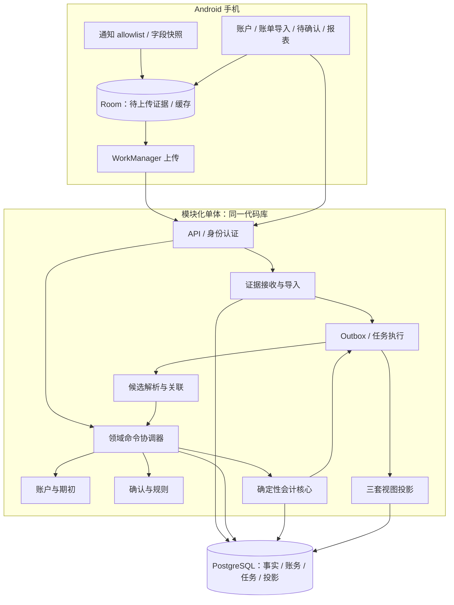

# 钱本 Technical Design v0.2

2026-10-06 · 同行调研与自审修订版 · 基于 PRD v0.3.2

本稿确定业务模块、数据权威、事务边界、异步协议和实现顺序；不是已经实现或测试通过的系统。后端语言已由用户确定为 Go，Android 保持 Kotlin。v0.2 是当前设计依据；v0.1 保留为历史稿。同行资料只作采集实践参考，不代表钱本已验证通知覆盖率。调研证据和自审记录见同目录 QianBen_Architecture_Review_2026-10-06.md。完整 DDL、迁移脚本与可运行原型是后续交付。

## 1. 架构决策

采用 Android 原生客户端＋模块化单体＋PostgreSQL。API 与 worker 使用同一代码库、同一领域逻辑，可以分别启动。服务端是正式账本的唯一写入权威；手机离线采集和缓存，不维护第二套可独立改写的正式账本。

MVP 不引入 Redis、Kafka、搜索集群或独立 AI 服务。数据库保存可靠任务及事务 outbox。AI、正式对账、折旧和估值按 PRD 后续版本引入。

| 决策 | 理由 | 代价/扩展条件 |
|---|---|---|
| 单体内跨模块数据库事务 | 事件接受与入账修复可以原子提交 | 模块禁止互相绕过服务写表 |
| 同一账本的领域写入串行化 | 简化候选竞争、merge/split、投影顺序 | 同一账本写吞吐受限；发现实际瓶颈再改细粒度锁 |
| 金额以整数分保存 | CNY 计算无浮点误差 | 原币和汇率另用定点十进制，明确舍入 |
| 证据/修订/账务追加，当前指针可更新 | 同时支持审计和高效当前查询 | 不把所有表都做成不可变事件流 |
| 异步报表按账本版本发布 | 避免修复只显示一半 | 报表允许延迟并显示数据版本 |

### 1.1 Go 实现选择

| 层 | 选择 | 使用边界 |
|---|---|---|
| HTTP | Go 标准库 net/http | JSON API、鉴权中间件、请求大小/超时限制 |
| PostgreSQL | pgx/v5、pgxpool | 显式事务、参数化查询、SQLSTATE 分类 |
| 查询代码 | sqlc | SQL 生成类型化访问；跨模块使用同一个 tx 和 WithTx |
| 日志 | 标准库 log/slog | 结构化错误码、trace 与 ID，不记录载荷 |
| 迁移 | 按序版本化 SQL | 独立迁移身份执行；服务启动不自动用 owner 改表 |
| 会计领域 | 自有 Go 纯函数 | CNY int64 分、溢出检测、受控账务提交，不使用 ORM 自动保存账务 |

具体依赖版本在搭建工程时锁定 go.mod/go.sum，不引用浮动 main。API 与 worker 共用 CommandService；Repository 不自行开始事务，不在领域事务内调用 pool 的独立查询。Commit 失败或结果不明不得向客户端报告入账成功，使用原 command_id 查询提交凭据。参考 [pgx](https://pkg.go.dev/github.com/jackc/pgx/v5)、[sqlc 事务](https://docs.sqlc.dev/en/latest/howto/transactions.html) 和 [Go 事务文档](https://go.dev/doc/database/execute-transactions)。

## 2. 组件图



图中箭头表达调用和数据流，不表示每一步都独立提交。命令协调器负责把需要一致生效的跨模块写入放进同一个事务。

## 3. 模块与数据权威

| 模块 | 拥有的数据 | 对外能力 |
|---|---|---|
| Identity | 用户、设备、会话、删除状态 | 鉴权、设备撤销、账本授权 |
| Evidence | SourceEvent、Observation、Delivery、解析结果版本、StatementImport/Line | 接收、去重、必要原文保留、可用证据查询 |
| Accounts | LedgerAccount、ExternalAccount、Instrument、Rail、FundingRelation、OpeningBalance | 账户映射、初始化、候选资金来源 |
| Events | Lineage、Revision、证据关联、身份关系、经济关系、实际资金证据 | 提议/接受解释、关联、修复计划 |
| Accounting | PostingIntent/Revision、Journal、LedgerEntry | 生成并验证会计计划、提交账务 |
| Review/Rules | ReviewTask、用户确认、Mapping/RuleVersion、生活分类版本 | 冲突处理、确认命令、规则生效范围 |
| Assets | Asset、购置关联 | 用户确认原值；MVP 不折旧 |
| Jobs | Outbox、Job、执行记录 | 至少一次执行、退避、死信、审计 |
| Reporting | 账户余额、生活消费、现金流、异常投影 | 版本一致的只读查询、重建 |

FinancialEvent 是已接受 EventRevision 的查询模型，不再创建可独立编辑的事实表。EventRevision 的 accepted 状态表示内容曾被接受；只有 lineage.current_revision_id 是当前接受版本的权威。历史 revision 无需被修改成 superseded。

Proposal 单独保存候选判断，不能覆盖当前接受事实。遇到新冲突，保留已有账务并标出 conflict/review；只有新的接受命令才能改账。

原始 Observation 与解析结果分离：升级 parser 产生新的 Interpretation，不能把 parser_version 改写进旧证据。用户补充作为新证据保存。模型输出只能进入候选，不伪装成原始字段。

## 4. 核心模型与约束

所有账本业务表带 ledger_id；外键采用 (ledger_id, id) 校验同账本关系。共享 PaymentRail 目录可以全局只读；用户资金映射必须属于账本。任何 id 都不能代替授权检查。

| 对象 | 关键唯一性/约束 |
|---|---|
| Delivery | (ledger_id, device_id, delivery_id)；相同键不同载荷报冲突 |
| SourceEvent | (ledger_id, source_identity, identity_kind, source_object_key) |
| Observation | 同来源对象的 evidence_snapshot_key 唯一，版本号唯一；payload_hash 仅校验内容 |
| Interpretation | (observation_id, parser_version, interpretation_version) |
| EventRevision | (ledger_id, lineage_id, revision_number)；当前指针必须引用同一 lineage |
| PostingIntent | (ledger_id, lineage_id, posting_purpose) |
| PostingRevision | (posting_intent_id, revision_number)，引用实际采用的 event_revision 和 rule/policy 版本 |
| Journal | 引用修复/提交操作、posting revision；reversal_of 至多一次且同账本 |
| LedgerEntry | debit/credit 非负且恰有一侧正；金额 CNY 整数分；账户同账本 |
| CommandReceipt | (ledger_id, command_id)，请求摘要必须一致 |
| ChangeSet | (ledger_id, ledger_version)；保存本次完整变化和重建所需引用 |
| ProjectionGeneration | (ledger_id, generation_id)，带 source_version 和算法版本 |
| RelationRevision | 关系修订追加；当前关系指针唯一，记录 allocation_amount、事实依据及 replaced_by |
| LedgerActivation | 账户初始化对应 activation_id；未激活的 staging 数据不能被正式查询读取 |

不能用普通行级 CHECK 验证整张分录的借贷和。采用唯一受控提交函数＋提交时延迟约束触发器检查每个 journal 至少两行且总借=总贷；journal 表自身也触发检查，不能让零行分录绕过只监听 LedgerEntry 的校验。应用角色无直接 INSERT/UPDATE/DELETE 账务表权限，仅允许调用提交入口。冲销精确交换原分录借贷，原科目、金额和有效时间保留。禁止余额作为事实直接覆盖。

提交函数在调用者既有事务内运行，内部也锁 Ledger 并检查账本状态、actor 授权、posting 当前版本、资金用途和账户归属。函数由 NOLOGIN 的受限 owner 拥有，PUBLIC 不可执行；使用固定 search_path 和限定 schema 名。API/worker 角色不能通过切换 owner 或直接修改 PostingIntent.current_revision 绕过函数；事件指针由 application 在同事务中切换。关闭的旧分录禁止追加行；延迟检查同时验证分录内容 hash/行数和冲销对称性。数据库迁移与删除清理使用独立身份。参考 [PostgreSQL 函数安全](https://www.postgresql.org/docs/current/sql-createfunction.html)。

数据库锁和约束依据：[PostgreSQL 锁](https://www.postgresql.org/docs/current/explicit-locking.html)、[约束](https://www.postgresql.org/docs/current/ddl-constraints.html)。上述账本串行化与提交入口是本项目设计选择。

### 金额与时间

- CNY 金额用 bigint 分；API 的 minor_units 固定为十进制整数字符串，不接收浮点。校验金额范围、加减溢出和至少两条非零分录；数据库汇总后也要验证能否无损转为 int64。
- 原币用精确 decimal 字符串及币种精度，汇率用 numeric；MVP 正式账户仅 CNY，外币消费需要可信最终 CNY 结算金额。
- economic_at、posted_at、observed_at、ingested_at、committed_at 分开。存 UTC 和原始时区/精度；账本报表时区默认 Asia/Shanghai，MVP 初始化后固定。
- 日期级时间表示可能发生的时间区间。区间横跨 cutover 时待确认；不得把日期机械补成午夜后自动入账。

## 5. 来源身份与证据采集

Android 使用 NotificationListenerService。回调先检查用户授权和精确包名 allowlist，再复制必要字段；本机串行 IO 写 Room，解析和上传离开主线程。标准监听授权通常具有较宽的通知访问范围，allowlist 是钱本自己的采集边界，不能宣称系统只授予了金融 App 的读取权。上传使用 WorkManager；回调到 Room 成功提交前仍有进程死亡丢失窗口，必须明确监控和补证据。

上传合同：schema_version、device_id/install_id、delivery_id、source_identity、source_object_key、episode_id、capture_sequence、capture_reason、lifecycle_hint、observed_at、notification_posted_at、event_time/precision、package/app_version、profile_scope、channel_id、notification_id/tag、group_key/is_group_summary、content_availability、结构化原始字段、必要财务片段、parser_version、payload_hash。字段缺失显式标记 unknown，不填假账户或假交易 ID。postTime 只表示通知发布时间，不能冒充交易发生时间。

delivery_id 在本机持久化时生成，重试不变；网络成功仅在逐项服务器 ACK 后标记。部分成功返回每项 accepted/duplicate/conflict/rejected，避免整个批次重复生成新 ID。

notification key 仅作为来源线索，不视为永久交易身份。设备安装实例、包、key、可用生命周期边界组成来源对象候选；没有可靠生命周期时不强行折叠。snapshot key 优先使用来源修订号或本机持久采集序号；完全相同重复回调的指纹折叠只在已确认同一来源对象、同一连续状态内使用。A→B→A 保留三次状态观察；不能全局按文本 hash 去重。

### 5.1 可借鉴的同行做法

[AutoAccounting](https://github.com/AutoAccountingOrg/AutoAccounting) 采用多种采集入口及规则适配；[其通知源码](https://github.com/AutoAccountingOrg/AutoAccounting/blob/34b38f82ca9ad6d7905c715c66891977f8809c88/app/src/main/java/net/ankio/auto/service/NotificationService.kt) 提取 title，并优先 bigText 再退回 text，还包括 allowlist 和断线重连。钱本借鉴字段抽取和适配器拆分；同文件中按内容指纹去重不能作为跨通知生命周期的交易去重。

[无感记账](https://github.com/DykiSensei/seamless-bookkeeping) 的 [采集服务](https://github.com/DykiSensei/seamless-bookkeeping/blob/af717f9faa5658b2e67dcc61e200867951806734/app/src/main/java/com/bookkeeping/app/notification/PaymentNotificationListenerService.kt) 分离 listener、parser 和 repository；其 [repository](https://github.com/DykiSensei/seamless-bookkeeping/blob/af717f9faa5658b2e67dcc61e200867951806734/app/src/main/java/com/bookkeeping/app/data/repository/TransactionRepository.kt) 用 60 秒内同来源同金额判断重复。前者用于模块设计，后者作为不能照搬的反例：可能丢失连续发生的真实交易，也不能代替跨来源事件关联。

[简记账](https://github.com/jinyule/bookkeeping) 将自动识别结果作为待确认记录，并保留手动/CSV 入口；[FinArt Android FAQ](https://finart.app/faq.html) 描述银行短信及通知等入口。前者提醒识别结果与入账需要隔离，后者说明渠道可以互补；二者公开说明不能证明钱本在中国支付场景的覆盖率。

### 5.2 通知适配器与字段边界

每个适配器按 package、可用 app_version 范围和 template_version 注册。金额匹配之外还必须验证交易模板、收支角色和最终资金状态。不能把微信普通聊天中的“我转了 100 元”识别为支付事实，也不能仅因来自银行 App 就信任所有含金额的营销通知。

包名检查后使用低成本模板门控，明确非财务内容不落盘、不上传；仅因来自微信不能把所有聊天通知保存到 Room。无法识别模板时默认保存无正文的诊断计数；必要的人工样本采集须用户主动启用，并脱敏、限制保存时间。财务候选只保留完成解析所需字段，识别后在 IO 队列落盘；调试构建也禁止自动打印通知正文。

保留 title、text、bigText 的原始独立字段；按模板选取 textLines、MessagingStyle 中必要消息。不盲目拼接所有字段重复提取金额。FLAG_GROUP_SUMMARY 默认不直接产生事件；若只有聚合通知或无法区分多笔，保留诊断状态并补账单。字段定义参考 [Android Notification](https://developer.android.com/reference/android/app/Notification)。

通知 episode 在 Room 持久维护：去重摘要限定 install/profile/package/key/episode。通知删除只结束已知展示生命周期，不等于付款撤销；只有金融状态证据可撤销账务。重连时来源生命周期不确定的重复通知保留证据并进入关联候选，不能用哈希压掉可能的新交易。

### 5.3 连接恢复、权限与覆盖率

连接成功后扫描 getActiveNotifications，并与已保存 episode 比对；这是对当前仍可见通知的恢复，不是历史通知回放。断开期间记录 coverage_gap，仍可缓存和展示账本；有权限时对钱本实际 listener 组件做有限退避 requestRebind。主线程回调、连接时机和 API 约束以 [NotificationListenerService 官方说明](https://developer.android.com/reference/android/service/notification/NotificationListenerService) 为准。

Android 15 CDD 要求普通通知监听器接收的敏感内容被遮蔽（存在指定例外；其中明确举例 OTP 等认证内容）；不能把授权成功等同于通知文本一定可读。[Android 15 CDD §3.8.3.4](https://source.android.com/docs/compatibility/15/android-15-cdd#3_8_3_4_sensitive_notification_protection)。缺金额、锁屏隐藏、工作资料/分身应用无法访问分别记 content_availability/coverage，不猜缺失字段，也不通过扩大权限假装补齐。

MVP 入口保持标准通知＋CSV＋手动。同行的 Root/Xposed、修改支付 App、无障碍读屏、Shizuku 或短信权限属于不同采集路线，当前不加入实现范围。未来经明确产品选择引入时，仍只产出 Observation，不能直接写账。是否提供可读通知、付款/退款/收款分别覆盖多少，均须真机验证；不把同行 README 当作支付 App 的稳定 API 合同。

### 5.4 Room 队列和上传唤醒

Room 原子保存 capture、episode 更新和 UploadQueue 行，delivery_id 和 sequence 同时落盘。WorkManager 只是唤醒器，Room 队列是待发送事实。Room 提交和 WorkManager enqueue 不是同一事务：在应用启动、listener 重连和用户刷新时扫描未 ACK 队列并补调度；有待传时注册受系统约束的周期补偿，清空后取消，避免无交易持续轮询。

一次性上传按设备建立唯一工作链，短时间采集可批量合并；采用 APPEND_OR_REPLACE 或等价的不会漏唤醒方案。仅用 KEEP 存在运行中尾部新入队任务被忽略的窗口，worker 读空结束后仍须有补偿入口。网络约束、退避及唯一任务语义参考 [WorkManager 任务管理](https://developer.android.com/develop/background-work/background-tasks/persistent/how-to/manage-work)。

worker 从 Room 读取有限批次，逐项 ACK；timeout 重传原 delivery，明确 rejected/conflict 保留本机并提示，不无限盲重试。PENDING、IN_FLIGHT、ACKED、BLOCKED 为队列状态；进程重启后超时 IN_FLIGHT 可重发。正常同步不使用长时间前台服务或永久 wake lock，采集延迟和上传延迟分别测量。

### 5.5 服务端接收原子性

同一短事务内插入 Delivery、SourceEvent/Observation、必要解析引用及 EvidenceReceived outbox。服务器提交后才逐项 ACK；若在提交后响应丢失，原 delivery 重试返回同一 observation_id。不能先保存证据、ACK 后才另行创建解析任务。SourceEvent 版本分配在对应来源行锁下完成。

客户端解析作为可追溯建议，服务端适配器再次校验可用原始片段、金额和资金状态。银行通知属于用户设备采集证据，不能宣称银行签名认证。缺少足够可校验片段时降低自动化权限并待确认，不能通过客户端 confidence 强行放行。

证据接收用 Ledger FOR SHARE 短锁，并在锁后检查 ACTIVE/DRAFT/DELETING；删除使用 FOR UPDATE，因此开始删除后不能继续接收新证据。不能只在事务外检查一次状态。该共享锁会与领域独占锁短暂竞争，接收事务内无模型调用或大文件解析。

### 5.6 真机实验交付

至少两种 Android 大版本和两个 OEM/ROM，按实际设备建立 App/version/ROM/场景矩阵。覆盖微信/支付宝/一个银行的付款、收款、退款、信用卡、相同金额连续两笔、通知更新、聚合、锁屏、重启、权限撤销、断线恢复及离线 ACK 重试。用手动场景记录或导出账单作为 ground truth，报告“生成可读通知率→采集率→字段完整率→正确关联/入账率”及样本数，不仅报告 parser 命中率。对 Android 15 的遮蔽和后续版本分别实测，不推断所有银行通知都会被遮蔽。

CSV：同文件 hash 防重复导入；有稳定来源行 ID 时按来源账户和 ID 识别，无 ID 时采用文件内行身份保存并对跨文件重叠提出候选，不按金额/商户相同删除两笔真实交易。解析失败行逐行报告，用户确认账户映射后才进入正式处理。MVP 仅支持显式注册的 CSV 适配器，不承诺所有电子账单格式。

## 6. 事件状态与入账矩阵

Lineage 生命周期：ACTIVE → MERGED / SPLIT / VOIDED，历史保留。处理状态是当前事实、证据和 review 的派生值：WAITING_EVIDENCE、REVIEW_REQUIRED、ACCEPTED、CONFLICT、HISTORICAL_ONLY。PostingIntent 状态：EMPTY、ACTIVE、REVERSED。解释被接受并不必然可以入账，例如账户未初始化。

| 情况 | 处理与正式账务 | 生活消费 / 现金流 |
|---|---|---|
| 处理中或资金账户未知 | 候选/待确认，无正式账 | 无；显示未完成 |
| 可信银行扣款，用途未知 | Dr 资产类待查款 / Cr 银行 | 不认消费；记录待分类现金流出 |
| 可信到账，用途未知 | Dr 银行 / Cr 负债类待查款 | 不认收入；待分类现金流入 |
| 借记卡消费事实明确 | Dr 费用 / Cr 银行 | 消费＋现金流出 |
| 信用卡消费事实明确 | Dr 费用 / Cr 信用卡负债 | 消费；当日现金流零 |
| 还信用卡 | Dr 信用卡负债 / Cr 银行 | 无消费；还款现金流出 |
| 转账转出/转入 | 各自对转账暂记入账 | 无消费；未闭合时显示待匹配流 |
| 退款、原费用依据充分 | Dr 银行或负债 / Cr 原费用 | 退款月负消费；实际现金账户变化 |
| 资产购买用户确认 | Dr 固定资产 / Cr 银行或负债 | 资产购置；按实际资金变化算现金流 |
| 资产购置退款 | 用户确认原值减记或完整退货，禁止套用费用退款 | 退款月冲减购置；按实际现金变化 |
| 垫付/报销 | 应收增加/收回 | 不算个人消费或收入；实际现金变化 |
| 起点前事件 | 历史证据，不正式入账 | 独立历史分析，不混进正式报表 |
| 起点后事件、账户未初始化 | 保存/接受事实，阻止入账 | 标记未覆盖，不当作零余额 |

原购买在 cutover 前的退款：已确认原费用且金额关系成立时可冲减起点后退款月份的费用；资产退货、已结清应收等情况须由账户起初包含的经济性质决定，不能套用通用消费退款。依据不足时可信到账先暂记，待用户确认。

预授权只保留证据和关系，不产生正式消费；结算事件入账一次。分期本金、利息、手续费需要明确拆分事实，否则待确认，不自动采用通知总额猜拆分。

## 7. 候选解析与接受

候选检索限定同账本，先强来源 ID，再按金额、币种、账户、时间区间查询索引。强 ID 也须限定 provider、账户及身份命名空间；不能跨账户无条件合并。

硬约束在规则/模型评分前后各检查一次。退款和结算属于不同事件，不成为同一事件簇。全簇检查禁止用传递相似性直接合并。明确两个独立订单 ID 时，即使同商户同金额也保持两笔。

MVP 自动入账白名单：明确最终资金状态、准确金额/CNY 结算、已初始化账户、起点后时间、无证据冲突且满足确定性模板。商户相似度只用于候选或生活标签，不能证明支付账户或消费性质。

自动确认交易仍可能后来发现是同一笔。因此本设计只能保证按当前已接受身份不重复，不声称系统能无条件识别全部现实重复。无法确定同一性的候选须 review，已入账的错误独立身份通过原子 merge 修复；误合并/漏关联作为质量指标独立测量。

## 8. 领域提交事务

所有修改接受事实、关系、规则生效、期初、资产及账务的命令，先锁 Ledger 行。证据接收只用短期共享锁；解析/模型调用在事务外进行。领域锁采用 SELECT FOR UPDATE，MVP 用 READ COMMITTED，所有领域 writer 遵循同一协议。并发串行化与用户预览版本检查是两件事：普通确认采用 affected entity revisions，避免无关新交易导致全账本 409；起点迁移、批量重算及跨事件修复使用更完整的 base_version/受影响集合检查。

```text
BEGIN
  校验账本 owner/status，锁 Ledger 行
  查询 CommandReceipt：同 ID 同摘要返回既有结果；不同摘要拒绝
  检查 worker 当前 job_id/lease_token（如有），与本次副作用同事务
  验证 expected_entity_revisions（批量命令另验 base_ledger_version）
  验证解析使用的 evidence/account/rule 版本
  重读当前事件簇、账户初始化和事实，拒绝陈旧修复计划
  执行确定性会计计划并验证跨账本、金额、cutover 和关系约束
  追加 Revision / Relation / Classification / RepairOperation
  必要时冲销旧 journal，追加新 journal，切换 current 指针
  ledger_version += 1；写完整 ChangeSet 和 outbox
  写 CommandReceipt（包括结果和版本）
COMMIT
```

受影响实体旧版本并发确认返回 409 和新版本，不能默默覆盖用户确认。自动 worker 陈旧版本重新解析后重试；死锁/临时数据库失败可有限退避，业务冲突进入 review。数据库超时导致提交结果未知时，使用原 command_id 查询/重试。

来源证据可能在命令期间继续到达；接受命令基于明确证据集合提交，新到证据触发下一轮解析。不能要求系统等待永远不结束的“所有证据”。

### Merge / Split

A merge 到 B：在锁内重新验证 A/B 及规范身份，拒绝环；未入账 A 退休；仅 A 已入账则冲销 A 并在 B 建立唯一账务；两侧已入账则保留经过验证的 B 效果并冲销 A，B 解释变化时也修订 B。A 的旧 intent 不改稳定身份，标为 REVERSED，不搬运唯一键。

split：新 B/C 在同事务内创建，校验金额及资金效果分配，冲销 A，提交 B/C，标记 A SPLIT。拆分消费分类而没有两个经济事实时只拆生活分类，不创建经济事件。

每笔技术冲销沿用被纠正效果的 effective_at，新解释按真实发生时间入账；发生在后来日期的业务退款/撤销是独立经济事件，不能当作技术冲销。

转账两端共享 transfer_group_id 或关系组件归属，每端保留自己的 intent。只关联不生成第三套转账；暂记核对按 transfer group，不能因为所有暂记总余额为零就认定每笔闭合。

修复同时校验全部引用 A 的退款、结算、转账和证据归属。关系有独立稳定身份和修订；merge 时明确重定向到规范事件，split 时按证据和金额分配到新事件，不自动复制到所有子事件。无法分配的旧关系转待确认，已由其产生的账务须同事务重验/修复。禁止悬空、自环、重复退款归属或旧 canonical intent 再激活。

退款使用 allocation_amount，当前已接受退款分配合计不得超过可退原金额；转账每一端不可在相同用途重复闭合到多个 group。手续费单独事件。多个退款或不同关系并发接受也在账本锁下检查总量。

## 9. 期初与账本生命周期

Ledger：DRAFT → ACTIVE → DELETING。cutover 和时区在激活后冻结；用户要求改变起点时使用显式新 epoch/新账本重建，不就地编辑现有账务。

统一起点期初：资产 Dr 资产 / Cr 期初净资产；信用卡欠款 Dr 期初净资产 / Cr 负债。期初专用稳定 posting purpose，不纳入收入/消费/现金流。

MVP 新账户补建先产生初始化计划，验证期初时点和待处理交易；设置单次行数和事务时长上限，在受控事务内提交期初及计划内账务并激活账户，后续新证据另行处理。若计划超过上限，保持未初始化并提示范围限制，不把分批正式入账误称为一次原子发布。

大历史重建后移：staging 中只保存非正式计划，最终发布须具有明确 activation/epoch 可见性合同，校验基准版本后一次切换；未定义该合同前不能将 staging journal 当作生产 journal。账本未完全覆盖时首页给出账户覆盖范围，不宣称完整净资产。

## 10. 异步任务与投影

Outbox 与领域提交/证据接收分别同事务写入；relay 将 outbox 转成幂等 Job，任务插入和标记分发同事务。MVP 数据库队列使用短事务领取、lease/token、可用时间及有限退避；崩溃后租约到期重新领取。旧 lease worker 的领域副作用和投影发布必须在各自提交事务内锁 Job 行，验证 token 及有效租约，不能只在事后 ACK 时检查；锁后用数据库实际当前时间检查租约，避免事务开始时间早于锁等待导致误判。全局锁顺序为 Ledger→Job→其他领域对象；领取仅锁 Job 并立即提交，绝不持有领取锁再等待 Ledger。队列 SKIP LOCKED 用于领取，不用于跳过账本提交锁。

业务任务至少一次，不承诺消息 exactly-once。消费者通过 command_id、目标事实版本和 projection watermark 去重。死信保留原因/引用，可手动重试；不因失败删除证据。

投影以 ledger_version 为统一顺序。每个 ChangeSet 是完整原子变化，分类和关联修改即使无 journal 也必须增加版本。consumer 发现版本缺口就等待/补取，低版本重复任务 no-op。

- 会计投影：所有已提交 journal 的借贷累加，包含原账、技术冲销和修正，净额一致；余额按科目正常方向展示。
- 生活投影：当前接受事件＋版本化分类＋退款关系，不直接累加技术冲销；资产购置统计一次，信用卡还款不统计消费。
- 现金流投影：当前账务效果的现金类账户变化＋关系分类；技术替换仅改变当前解释，不创造第二次真实流动。闭合内部转账从总体外部现金流中排除，账户明细保留。

跨日转账必须保留两端各自发生时间。报表区分 external_net_flow、internal_transfer_net_change、unresolved_net_flow 与 total_cash_change；期间期末现金−期初现金应等于三项之和。例：5 日转出 100、6 日转入 100，5 日外部净流为 0、内部转移现金变化为 −100，6 日为 +100。不能因为转账最终闭合，就抹掉 5 日银行现金下降。未识别两端的暂记列 unresolved，不以“内部”提前消失。

MVP 优先在同一账本一致快照下重算小账本，构建新投影 generation；三视图和异常数据全部写完才原子切换 active_generation。优化为 ChangeSet 增量时必须保持相同发布边界。

报表接口返回 source_version、latest_ledger_version、computed_at、coverage、unresolved_amount。写入返回 committed_version，前端显示“已保存，报表更新中”。账户详情可直接读取正式账务；首页三视图统一读一个 generation，不把不同版本数字混在一起。

重建在 REPEATABLE READ 快照内读取 Ledger 版本 V 和截至 V 的事实/当前指针，再取到不可变的投影输入；构建 V 的投影，随后追赶 V+1…，发布时不允许落后版本覆盖已发布的新版本。Revision、RelationRevision、Classification、Journal 均保存 committed_ledger_version；ChangeSet 记录旧/新指针及完整修复引用，不能单靠最新 current 指针声称能离线恢复过去版本。重建不调用模型、不重新关联事件、不重新入账；规则升级是另一个显式领域修订命令。

通知连接和 ingestion 诊断按独立 evidence_cursor/时间展示，不冒充正式账本 ledger_version。同金额、同来源仅是候选，不是确定去重。自动解析固定 resolver/parser/policy/rule 版本，强冲突统一进入 review，不使用任务到达顺序决定哪个字段覆盖哪个。相同最终证据集应得到等价账务和报表，允许修订审计路径不同。

## 11. API 草案

| 接口 | 合同 |
|---|---|
| POST /v1/ledgers | 新建 DRAFT，CNY、cutover、时区 |
| POST /v1/ledgers/{id}/accounts | 外部账户和账本账户映射 |
| POST /v1/ledgers/{id}/opening-balances:confirm | command_id、expected_account_revision、base_ledger_version、截至时点、余额含义 |
| POST /v1/ledgers/{id}/observations:batch | 逐项 ACK，不代表已入账 |
| POST /v1/ledgers/{id}/imports | 文件/格式/账户；异步返回 import_id |
| GET /v1/ledgers/{id}/events/{event_id} | 证据、当前解释、历史、账务和待确认原因 |
| POST /v1/ledgers/{id}/reviews/{review_id}:resolve | command_id、expected_entity_revisions、确认/改用途/实际资金来源/是否创建未来规则 |
| POST /v1/ledgers/{id}/events:merge 或 :split | 显式计划与影响预览、版本校验 |
| GET /v1/ledgers/{id}/reports/overview | 一致 generation、可信度和未覆盖账户 |
| GET /v1/ledgers/{id}/sync?after=cursor | 云端变更同步，不用客户端时钟排序；cursor 绑定账本/epoch，过期返回 reset_required 并提供快照 |
| DELETE /v1/ledgers/{id} | 异步删除，立即停止采集同步及后台改账 |

身份从会话解析；请求 user_id 不具备授权效力。写入命令幂等键有明确作用域与存储期限，普通失败重试不生成新键。规则保存独立于单次确认，默认只影响确认后接收的新事件；迟到旧事实及历史批量应用需显式选择适用范围并记录。

规则决策另保存 applicability（交易发生区间、接收区间、目标事件集合）；展示标签规则可以学习，默认银行卡偏好不能升级为实际出资证明。重放复用已记录规则版本而非当前最新规则。

## 12. 部署与安全

初始部署：TLS 入口、一个 API 进程、一个 worker 进程、PostgreSQL。可部署在单台主机，但不是高可用；备份存到独立受控存储并做恢复演练。容量、RPO/RTO 与数据保留天数在上线设计中根据实际使用和成本明确，当前不伪造 SLA。

数据库最小权限；账务提交角色和投影只读/写投影角色分离。日志只保存 trace、ID、错误码，禁止载荷/通知全文/完整账号。设备缓存使用平台密钥保护敏感字段，服务端数据库卷及备份加密，密钥与数据分离。

删除先将账本设为 DELETING，撤销设备与作业，领域提交再次校验状态；后台清理证据、账务、投影、附件及密钥。备份在明示周期到期清理；恢复必须先应用独立删除记录，防止恢复后重新出现已删除账本。本机在线设备同步删除，长期离线设备需重新认证后清理缓存，不能承诺远程瞬时删除离线设备。

指标：队列最老年龄、死信、每账本锁等待、投影版本差、暂记老化、误关联/误自动入账、设备采集最后时间、导入失败率。采集在线与银行对账是不同可信度，不混成一个绿色“可信”标签。

## 13. 代码目录建议

```text
android/                       # UI、采集、Room、同步
backend/
  cmd/api/
  cmd/worker/
  internal/identity/
  internal/evidence/
  internal/accounts/
  internal/events/
  internal/accounting/
  internal/review/
  internal/assets/
  internal/reporting/
  internal/jobs/
  internal/application/        # 命令与跨模块事务
  internal/platform/           # DB、认证、日志
  migrations/
contracts/                     # API、证据 schema、错误码
testdata/                      # 脱敏真实样本和故障场景
docs/adr/                      # 决策变更记录
```

同模块领域代码不依赖 HTTP/Android；会计 planner 是纯函数，输入接受事实/账户快照/政策版本，输出分录计划或明确阻塞原因。API 与 worker 只能通过 application 命令入口接受事实/修账。

## 14. 验证与落地顺序

1. 通知真机 spike 与 CSV 样本采集：验证真实字段和生命周期，决定主要入口。
2. 账务垂直切片：账户＋期初＋手动消费＋暂记纠错，落实数据库约束及提交函数。
3. 证据管线：Room 持久化、上传 ACK、来源快照、CSV 导入和规则解析。
4. 事件关联与用户确认：强证据关联、候选 review、退款、信用卡、转账两端。
5. 修复与投影：merge/split 原子事务、完整 generation 发布和重建。
6. 发布前：租约/提交未知/删除/恢复故障测试、真机耗电和 API 性能实测。

测试必须使用真实 PostgreSQL 验证事务行为。关键断言：逐 journal 平衡；同 purpose 仅一个当前 intent 效果；merge/split 任一点失败全回滚；两 worker 修同账本结果串行；陈旧确认 409；同金额连续真实购买保留两笔；预授权不消费；信用卡消费/还款与资产购置口径正确；旧任务不覆盖新投影；重建与在线查询在同 source_version 完全一致。有限验收样本零错误不等于生产误判率为零。

下一份实现设计应交付：完整 PostgreSQL DDL 与触发器/提交函数、领域命令状态机、Android payload JSON Schema、OpenAPI 及一套可运行故障测试。后端使用已确认的 Go，Android 使用 Kotlin，后续按这一组合搭建工程。

本次设计自审已修正采集持久化/任务原子性、通知身份、敏感遮蔽、陈旧任务副作用、全账本版本冲突、关系重定向、跨日转账、初始化可见性和重建输入。它们仍需真机实验及 PostgreSQL 故障测试验证；设计修正不等于执行验证通过。
